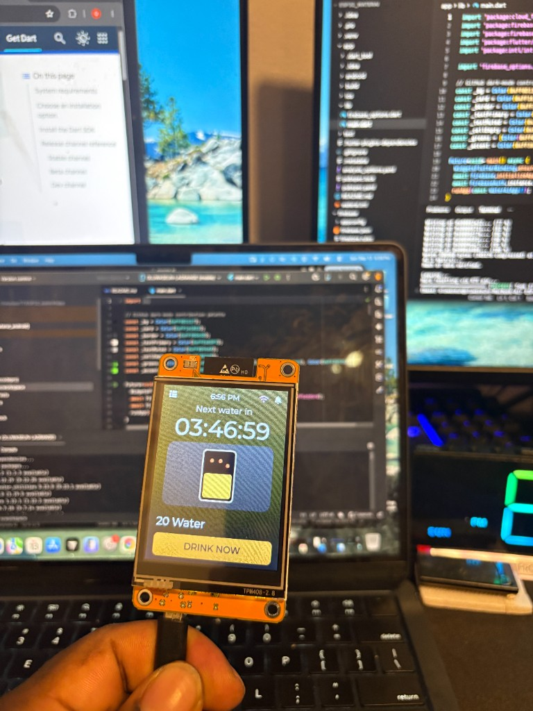
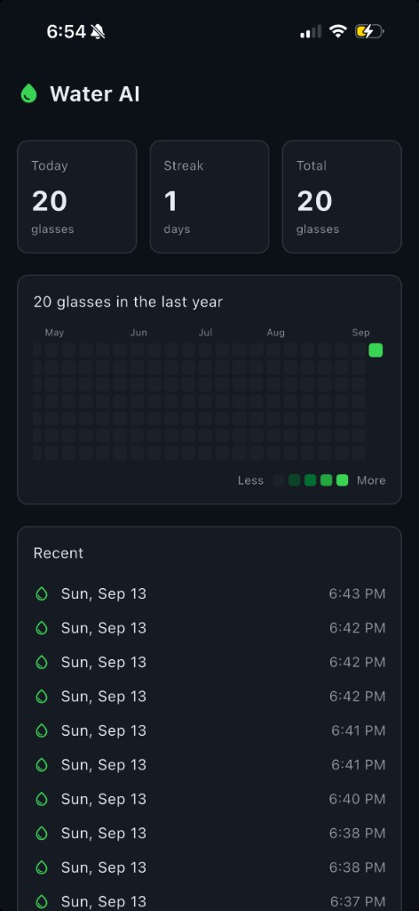

# Water AI

ESP32 Cheap Yellow Display water reminder with cloud sync and a Flutter companion app (GitHub-style heatmap).

<p align="center">
  
</p>

<p align="center"><em>ESP32 Cheap Yellow Display — countdown, animated glass, DRINK NOW</em></p>

<p align="center">
  
</p>

<p align="center"><em>Flutter companion app — live count, streak, and GitHub-style heatmap</em></p>

## Hardware

- ESP32-2432S028R ("Cheap Yellow Display") — 2.8" ILI9341 + resistive touch

## Firmware (PlatformIO)

```bash
cp include/secrets.example.h include/secrets.h
# edit include/secrets.h with Wi-Fi + Firebase API key

python3 -m venv .venv
.venv/bin/pip install platformio
.venv/bin/pio run -t upload
```

## Flutter app

```bash
cd app
flutter pub get
cd ios && pod install && cd ..
flutter run
```

## Firebase

Project: `esp32-waterai`

```bash
cd firebase
firebase deploy --only firestore:rules --project esp32-waterai
```

Enable **Anonymous** sign-in in the Firebase console before first use.
